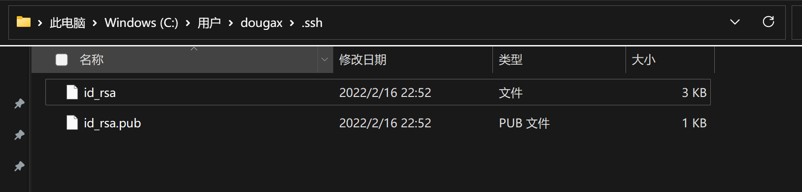
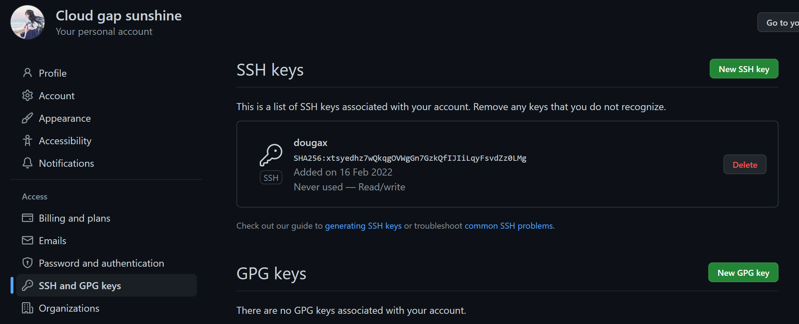
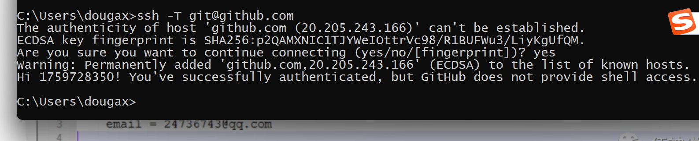

##### 为啥每次提交都需要输密码?
因为你git remote add 的是https的协议url
只要改成ssh的url就不需要验证了

```shell
//先删除之前关联的远程仓库名,以防之后再add时name重复
git remote rm regression 
//重新关联
git remote add regression git@github.com:1759728350/breathe.git
//之后正常提交就行了
```
##### pull不下来rebase强制覆盖

```shell
$ git push note master
To github.com:1759728350/note.git
 ! [rejected]        master -> master (non-fast-forward)
error: failed to push some refs to 'github.com:1759728350/note.git'
hint: Updates were rejected because the tip of your current branch is behind
hint: its remote counterpart. Integrate the remote changes (e.g.
hint: 'git pull ...') before pushing again.
hint: See the 'Note about fast-forwards' in 'git push --help' for details.

dougax@lyh MINGW64 /d/elecbook (master)
$ git pull --rebase note master
From github.com:1759728350/note

 * branch            master     -> FETCH_HEAD
   Successfully rebased and updated refs/heads/master.
```

##### add.不能乱用
add是将文件加入到缓存区且让git能追踪到
add . 将所有文件到加入了,有的文件你还没修改后就不要急着推上去


## 待解决
当需要用到这些命令时再去学吧
git 查看暂存区的使用场景挖坑
git diff 命令
git rebace
查看及删除git远程库不需要的文件
思考


参考
[学习笔记](https://gitee.com/hongjilin/hongs-study-notes/tree/master/%E7%BC%96%E7%A8%8B_%E5%89%8D%E7%AB%AF%E5%BC%80%E5%8F%91%E5%AD%A6%E4%B9%A0%E7%AC%94%E8%AE%B0/Git%E5%AD%A6%E4%B9%A0%E7%AC%94%E8%AE%B0#1git-stash)
[车子的git十篇命令解析](https://blog.csdn.net/longintchar/category_7883282.html)


## git安装及搭建
打开 [git 官网] https://git-scm.com/，下载 git 对应操作系统的版本。

安装成功后在开始菜单中会有 Git 项，菜单下有 3 个程序：任意文件夹下右键也可以看到对应的程序！


**Git Bash：**Unix 与 Linux 风格的命令行，使用最多，推荐最多

**Git CMD：**Windows 风格的命令行

**Git GUI**：图形界面的 Git，不建议初学者使用，尽量先熟悉常用命令

```shell
#查看系统config
git config --system --list
　　
#查看当前用户（global）配置
git config --global  --list
```


所有的配置文件，其实都保存在本地！

查看配置 git config -l


查看不同级别的配置文件：  

```shell
git config --global user.name  #查看名称
git config --global user.email  #邮箱
#这个用户名和密码仅仅只是区分 不同合作开发者的  和github以及gitee没关系
```


##### 设置用户名与邮箱（用户标识，必要）

当你安装 Git 后首先要做的事情是设置你的用户名称和 e-mail 地址。这是非常重要的，因为每次 Git 提交都会使用该信息。它被永远的嵌入到了你的提交中：

```shell
$ git config --global user.name "hedley"
$ git config --global user.email "1759728350@qq.com"
```

只需要做一次这个设置，如果你传递了 --global 选项，因为 Git 将总是会使用该信息来处理你在系统中所做的一切操作。如果你希望在一个特定的项目中使用不同的名称或 e-mail 地址，你可以在该项目中运行该命令而不要 --global 选项。总之 --global 为全局配置，不加为某个项目的特定配置。

### 配置ssh公钥

```shell
ssh-keygen -t rsa -C "1759728350@qq.com"
```

然后用户主目录/.ssh/下有两个文件，id_rsa是私钥，id_rsa.pub是公钥



将上面的id_rsa.pub文件里的内容复制,放进github里的ssh中




测试是否连接成功
ssh -T git@github.com




**Git 相关的配置文件：**

1）、Git\etc\gitconfig  ：Git 安装目录下的 gitconfig     --system 系统级

2）、C:\Users\Administrator\ .gitconfig    只适用于当前登录用户的配置  --global 全局

这里可以直接编辑配置文件，通过命令设置后会响应到这里。


### 本地仓库搭建

git init

> init：初始化当前目录为仓库，初始化后会自动将当前仓库设置为master

```shell
#在要建立本地仓库的文件夹下右键  git bash here

# 在当前目录新建一个Git代码库
dougax@lyh MINGW64 /d/github/test
$ git init
Initialized empty Git repository in D:/github/test/.git/
```

创建本地仓库的条件是需要一个空目录，然后在空目录中初始化你的项目

如我想创建一个名为“test”的空项目

1.创建目录

```bash
mkdir test
```

2.进入目录

```bash
cd test
```

3.使用git init初始化当前仓库

```bash
git init
```

ls-ah查看隐藏文件, 查看被设置为仓库的目录所生成的 .git 隐藏文件


创建本地仓库的方法有两种：一种是创建全新的仓库，另一种是克隆远程仓库。
1、创建全新的仓库，需要用 GIT 管理的项目的根目录执行：
2、执行后可以看到，仅仅在项目目录多出了一个. git 目录，关于版本等的所有信息都在这个目录里面。


### 忽略文件

```
#为注释
*.txt        #忽略所有 .txt结尾的文件,这样的话上传就不会被选中！
!lib.txt     #但lib.txt除外
/temp        #仅忽略项目根目录下的TODO文件,不包括其它目录temp
build/       #忽略build/目录下的所有文件
doc/*.txt    #会忽略 doc/notes.txt 但不包括 doc/server/arch.txt
```

有些时候我们不想把某些文件纳入版本控制中，比如数据库文件，临时文件，设计文件等

在主目录下建立 ".gitignore" 文件，此文件有如下规则：

1.  忽略文件中的空行或以井号（#）开始的行将会被忽略。

2.  可以使用 Linux 通配符。例如：星号（*）代表任意多个字符，问号（？）代表一个字符，方括号（[abc]）代表可选字符范围，大括号（{string1,string2,...}）代表可选的字符串等。

3.  如果名称的最前面有一个感叹号（!），表示例外规则，将不被忽略。

4.  如果名称的最前面是一个路径分隔符（/），表示要忽略的文件在此目录下，而子目录中的文件不忽略。

5.  如果名称的最后面是一个路径分隔符（/），表示要忽略的是此目录下该名称的子目录，而非文件（默认文件或目录都忽略）。使用码云

