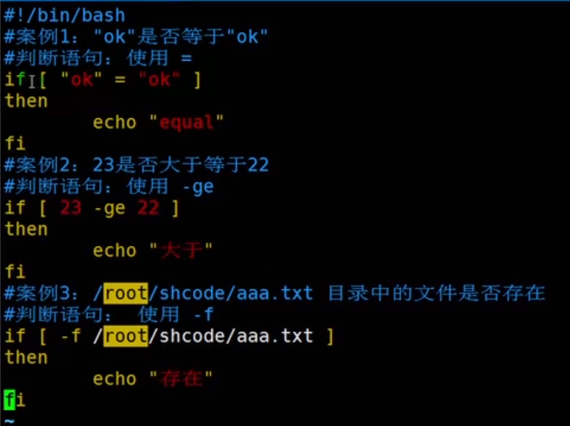
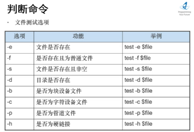
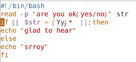
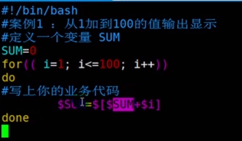
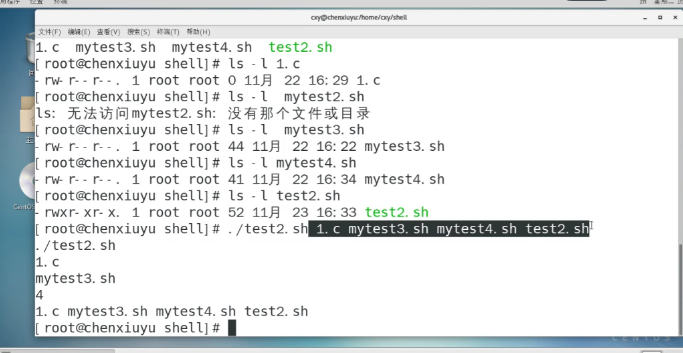
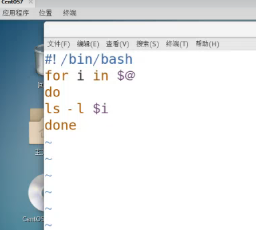

# shell脚本

该语言凭借系统自身解析编译，不需要下载编译器

```shell
#!/bin/bash              ##这是一个shell脚本   
```

### 两种执行脚本方式

```shell
source 或者 . ##在当前shell进程下执行
. first.sh                 //必须加点杠才能执行sh命令


bash 脚本    ##在新开的子bash中执行脚本
bash first.sh          //第二种方式，根据脚本定义的解析器来执行命令   无视权限

##无权限仍可以执行     ，可以得出用户在可读当前脚本时即使无执行权限仍可借由解析器间接执行

-rw-r--r--. 1 root root 37 11月 18 11:08 first.sh
-rw-r--r--. 1 root root 88 11月 18 11:17 test
[root@liyonghai shell]# bash first.sh 
 2 10 88 test
```

##### 子shell不会覆盖变量

bash执行脚本创建子shell执行脚本,所以不会更改当前的环境变量

而直接点执行会成功修改, 因为子shell只会在自己的作用域中修改变量

```shell
vim b.sh
#!/bin/bash
$name="hedley"

. b.sh  ##当前shell下执行该脚本

vim a.sh
#!/bin/bash
$name="son"

bash a.sh  ##开一个子shell执行
echo $name   ##hedley,说明没有发生覆盖更改
```


### 变量

##### 变量种类

本地变量  只能用在bash的当前进程中,会被销毁

环境变量   称为全局变量,所有的bash中都可以用,已经被持久化的变量,不会被销毁

局部变量   shell脚本中定义的变量

##### 系统变量

$HOME  $PATH   获取值加$

##### 用户自定义变量

```shell
A=100                          ##等号前后不要加空格,shell脚本中不能乱加空格
echo "A=$A"

##当我们想在复制诸如lyh 123则会报错

a="100 sjdksa"
##想要值中有空格就加双引号
```


##### 静态变量不能unset

```shell
readonly a=1000
echo "a=$a"
unset a                       //报错
```


##### 单引号和飘号双引号

```shell
#!/bin/bash
#a:lyh

name=lyh
echo ${name}              //输出为lyh
echo "${name}"            //输出为lyh
echo '${name}'           //输出为$name

##单引号不解析语法,飘号表示当做命令输出
```

飘号让变量可以接收命令的输出

```shell
dir=`ls`
echo $dir
bin boot data dev etc home lib lib64 lost+found media mnt opt proc root run sbin shellscript.sh 
```

双引号做参数替换防止意外

```shell
是否要加双引号取决于这个串会不会做替换
tip="a=$0"
echo "$tip"
##如果一个字符串包含空格或特殊字符（如$、*、|等）
##shell脚本本身对于命令替换和赋值单纯就是简单的字符串拼接替换,所以不加双引号容易出现意外情况

```


##### read读取输入值

```shell
read -t 10 -p "输入个值" S        #-p输入友好提示
echo "$S"						 #-t 10 表示10秒内输入,10秒接收不到直接执行程序
```

### 常用环境变量

##### 特殊状态变量

```shell
echo $?  ##输出上一命令是否执行成功  1-255执行失败  0表示执行成功
##脚本中常用来判断上一步骤是否执行成功

```
##### 个人环境变量配置文件

```shell
~/.bash_profile    ~/.bashrc  ##这些文件上配置用户特有的环境变量,当用户远程登录时会执行赋值
##所以修改后要exit退出重新登录才会生效
```

系统环境配置文件

```shell
/etc/profile   /etc/bashrc
```

##### 查询和设置环境变量

查询环境变量

set查看所有变量

```shell
name=hedley        ##定义一个临时变量
set | grep ^name    ##set包括所有变量,可以查到临时变量,持久化的环境变量
##输出name=hedley
```

env查看环境变量

```shell
env | grep PATH
PATH=/usr/local/sbin:/usr/local/bin:/usr/sbin:/usr/bin:/root/bin

export | grep PATH   ##效果一样
```

```shell
在/etc/profile下 export TOMCAT_HOME=/opt/tomcat

source /etc/profile   刷新数据重新配置

然后输出echo $TOMCAT_HOME
```


##### 在开机启动脚本中设置环境变量和预执行程序

对于数据库服务（如MySQL），在系统启动时设置环境变量可以确保数据库服务能够以正确的参数和配置启动。以下是一个示例，详细说明如何在系统启动时为MySQL设置环境变量：

1. **编辑`/etc/rc.d/rc.local`文件**：

```bash
sudo nano /etc/rc.d/rc.local
```

2. **向`rc.local`文件添加设置环境变量的内容**：  
    假设我们想在系统启动时设置MySQL的root用户密码、创建的数据库名称以及用户和密码。我们可以添加如下内容到`rc.local`文件中：

```bash
#!/bin/bash
export MYSQL_ROOT_PASSWORD="your_root_password"
export MYSQL_DATABASE="your_database_name"
export MYSQL_USER="your_user"
export MYSQL_PASSWORD="your_password"
```

请替换上面的`your_root_password`、`your_database_name`、`your_user`和`your_password`为实际需要设置的值。

3. **保存并退出文件**：按下`Ctrl + X`，输入`Y`确认保存，然后按`Enter`键退出。
    
4. **赋予`rc.local`文件执行权限**：
    

```bash
sudo chmod +x /etc/rc.d/rc.local
```

5. **重启系统**：

```bash
sudo reboot
```

你可以在MySQL启动脚本中通过`${变量名}`的方式引用这些环境变量。例如，在启动MySQL服务之前，可以这样设置MySQL的root密码、创建数据库和用户：

```bash
mysql -u root --password=${MYSQL_ROOT_PASSWORD} -e "CREATE DATABASE ${MYSQL_DATABASE};"
mysql -u root --password=${MYSQL_ROOT_PASSWORD} -e "CREATE USER '${MYSQL_USER}'@'localhost' IDENTIFIED BY '${MYSQL_PASSWORD}';"
mysql -u root --password=${MYSQL_ROOT_PASSWORD} -e "GRANT ALL PRIVILEGES ON ${MYSQL_DATABASE}.* TO '${MYSQL_USER}'@'localhost';"
```

请确保你在使用这些环境变量之前，已经加载了`/etc/rc.d/rc.local`文件或者重启了系统。通过这种方式，你可以在启动时设置的环境变量在系统启动后被正确应用，以及运行相应的服务或脚本。

### 脚本执行

##### 脚本入参

```shell
$0 表示命令本身
$1-9 表示入参  9以后需要加花括号${10}
$# 获取参数总个数
$* $@都是获取所有参数$@接收的是一个数组
```

```shell
#!bin/bash
echo "命令本身是\$0=$0 第一个参数\$1=$1 第二个参数\$2=$2"
echo "\$*,所有参数为'$*"
echo "\$@是$@"
echo "\$#参数个数$#"  


[root@lyh share]# bash paramtest 1 2
命令本身是$0=paramtest 第一个参数$1=1 第二个参数$2=2
$*,所有参数为'1 2
$@是1 2
$#参数个数2
```

### 运算符号


#### 双括号
>双括号(())表示里面存在运算表达式
```shell
read -p "n1:" n1
read -p "n2:" n2
sum="$(($n1+$n2))"  ##sum之前不能加空格
echo "n1+n2=$sum"
##-----------------------------执行结果--------------------
 . sum.sh    
n1:1
n2:2
n1+n2=3
```
例2  读取命令行第一第二个参数,然后将其放入到运算表达式中输出结果
```bash
#!/bin/bash
echo "$(($1+$2))"
[root@VM-4-10-centos testdir]# . sumab.sh 1 2
3
```
获取某个算术运算表达式的值就用$(())
```shell
##赋值运算
##写法一内部赋值
echo $((i=i+1))
##外部赋值
i=$(i+1)
echo $i
##逻辑运算
echo $((8>7))  ##输出为1     false为0

((8>7&&5==5))   ##输出为1
```
for循环中的for表达式也需要双括号
```bash
total=0 
for ((i=1; i<=100; i++)) 
do 
	total=$((total + i)) 
done 
echo "1到100的和为：$total"
```

#### 方括号
参考if下面的条件判断式

>等效与双括号(()),做逻辑比较运算和算术运算
- `=`, `!=`, `-z`, `-n` 等用于比较字符串。
- `-f`, `-d`, `-r`, `-w`, `-x` 等用于检查文件属性。
- `-e`, `-s`, `-r`, `-w`, `-x` 等用于检查文件是否存在或可读写执行。
```shell
if [ $a -eq $b ] 
then 
	echo "a 等于 b"
fi
```

#### 花括号
>用来做类似于python中的range()

```bash
    for i in {1..5}
    do
        echo "Number: $i"
    done
```
##### 花括号用于变量拼接字符串

```shell
name="Alice"
greeting="Hello,     ${name}hedley!"   
不用花括号包着,name就会连着hello,的同时,和后面的hedley连在一起了
```

### 控制语句

#### if



```shell
#必定返回真或假的情况
if[  ] #默认返回false ,两边括号内部要有空格
if[ sss ] #括号内有内容默认返回true ,两边括号内部要有空格
```

##### 条件判断式







所有括号


read -p "are you ok(yes/no)" str

```shell
if[[ $str = [Yy]es ]];then
```


##### 程序实践

```shell
#!/bin/bash
if [ $1 -ge 60 ]
then
echo "及格"
elif [ $1 -lt 60 ]   #注意elif后面也需要空格
then
echo "不及格"
fi

[root@lyh share]# bash iftest1 47
不及格
```


##### 菜单

```shell
#! /bin/bash
source luanf.sh
source guess.sh

function show(){
echo "diyi$1"

}
while true
do
echo "menu"
echo "1 add_int"
echo "2 add_users"
echo "3 guess"
echo "4 exit"
read -p "please choose" choice 
case $choice in
1)sum ;;
2)show 22 ;;
3)rand ;;
*)show 44444 ;;
esac
done
```


#### for

##### 取值运算符




##### for实践

```shell
[root@lyh share]# bash fortest.sh 1 2 55
58


#!/bin/bash

RESU=0
for i in "$@"
do
RESU=$[$RESU+$i]
done
echo $RESU
```


批量创建用户

```shell
[root@liyonghai shell]# cat add_users.sh 
usr=`cat ./use.txt`
for i in $user
do
  useradd $i
  echo "123456"|passwd --stdin $i
  #删除 userdel -r $i
done


bash -x add_users.sh
```

cat /etc/passwd  查看创建的用户

#### while

```shell
#!/bin/bash
#从输入的参数截止0到n的和,步长为1
SUM=0
X=0
while [ $X -le $1 ]

do
SUM=$[$SUM + $X]
X=$[$X+1]
done
echo "$SUM"

#bash -x以debug模式调试程序
[root@lyh share]# bash -x  whiletest.sh 4
+ SUM=0
+ X=0
+ '[' 0 -le 4 ']'
+ SUM=0
+ X=1
+ '[' 1 -le 4 ']'
+ SUM=1
+ X=2
+ '[' 2 -le 4 ']'
+ SUM=3
+ X=3
+ '[' 3 -le 4 ']'
+ SUM=6
+ X=4
+ '[' 4 -le 4 ']'
+ SUM=10
+ X=5
+ '[' 5 -le 4 ']'
+ echo 10
10
```

##### 猜数

```shell
[root@liyonghai shell]# cat guess.sh 
#!/bin/bash

num=$((RANDOM%100))          #$[RANDOM%100]


while true
do
read -p "please write your guess number" answer
if [ $num -gt $answer ]                 #注意if和elif后面要加空格
then
echo "your num is smaller"
elif [ $num -lt $answer ]             #[[ $num < $answer ]] 采用c语言方式算 要额外加个括号
then                                #由于shell内本来就没有< >号 而是-eq -lt -gt
echo "your num is bigger"
elif [ $num -eq $answer ]
then
echo "yes";break
fi
done
```


### 函数

#### 系统函数

##### basename和dirname

```shell
basename /home/aaa/test.txt
#结果test.txt
basename /home/aaa/test.txt txt
#结果test

dirname /home/aaa/test.txt
#结果/home/aaa
```

#### 函数

输入两个数相加

```shell
bash -x funtest.sh 
read -p 请输入第一个加数 n1
请输入第一个加数4
read -p 请输入第二个加数 n2
请输入第二个加数5
+ getSum 4 5
+ SUM=9
+ echo 9
9

#!/bin/bash
read -p "请输入第一个加数" n1
read -p "请输入第二个加数" n2
function getSum(){
        SUM=$[$n1+$n2]
        echo "$SUM"
        exit 1       ##给函数一个退出码
}


getSum $n1 $n2
```

##### 函数调用

```shell
#! /bin/bash
function sum(){    #在脚本文件外加个function就可以变为函数

 n=0
 for((i=0;i<=100;i++))
 do
  let n+=$i

 done
 echo "$n"
}
sum                             #函数调用


#通过source 另一个文件调用luan.sh的sum函数
yonghai shell]# cat menu.sh 
source luanf.sh
sum

```

##### 脚本参数和函数参数

```shell
[root@liyonghai shell]# cat hh.sh 
function show(){
echo "diyi$1"


}

case $1 in 
1) show h1;;
2) show h2;;
*) show h3;;
esac


[root@liyonghai shell]# bash hh.sh 1
diyih1
[root@liyonghai shell]# bash hh.sh 4
diyih3
[root@liyonghai shell]# bash hh.sh 455
diyih3
```


###   参数获取

#!/bin/bash

echo $0
echo $1
echo $2
echo $#
echo $@

[root@liyonghai shell]# ./lll.sh  1 2 3 4
./lll.sh
1
2
4
1 2 3 4





#### 多参数循环取出

#!/bin/bash
for i in $@
do
ls -l $i
done

结果：

[root@liyonghai shell]# ./loop.sh lll.sh ll.sh
-rwxr-xr-x. 1 root root 53 11月 23 16:34 lll.sh
-rwxrwxrwx. 1 root root 28 11月 23 16:45 ll.sh

## 变量替换


unset 将test变量的值清空

若空则输出999


冒号减：若变量为空  则用后面值替换  本值为null

冒号=：变量为空 后面值替换 本值被替换

冒号加：若变量有值 则用后面值替换


